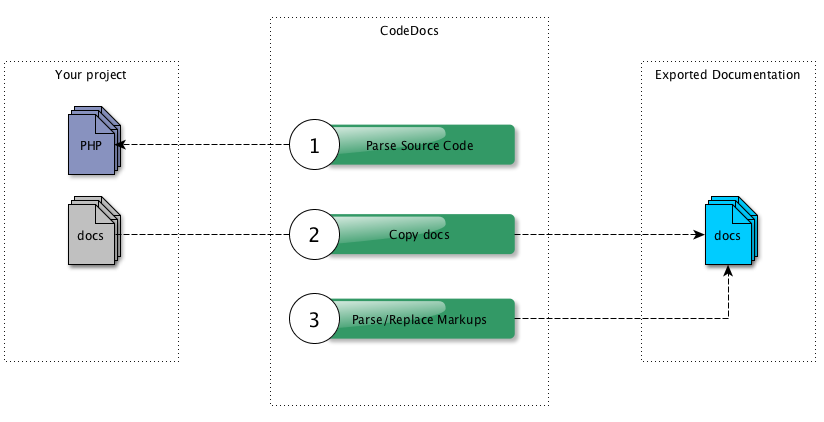

# What is CodeDocs?

With **CodeDocs** you can write a technical documentation that is able to access
the source code of your project. This means if the source code changes,
the documentation is updated automatically!

The documentation consists of **plain text files** (e.g. Markdown) which are located
directly in the project's repository or even in the **Doc Comments** of your classes.
You can use **Markups** to access the source code or generate documentation segments.

When you execute CodeDocs, the following happens:

1. Parse source code (create a list of all classes, methods, etc)
2. Copy documentation source to configured export directory
3. Replace Markups in exported documentation

> **Note:** If you use Markdown for instance and you want to generate HTML at the end,
> you can use a [Processor](processors.md) in combination with a tool of your choice that
> converts Markdown to HTML. Because CodeDocs itself does not take care of converting
> the files to another type

By the way, this documentation was also created by CodeDocs itself.

See [Quick Start](01.Quick-Start.md) to start with your first documentation.
